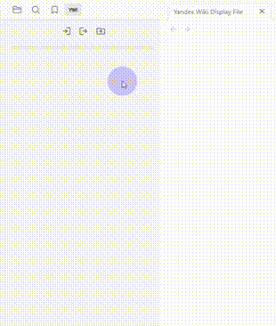
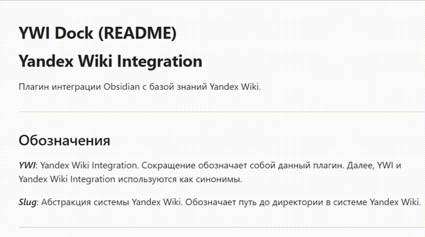

# Yandex Wiki Integration

Плагин интеграции Obsidian с базой знаний Yandex Wiki.

---
## Обозначения

***YWI***: Yandex Wiki Integration. Сокращение обозначает собой данный плагин. Далее, YWI и Yandex Wiki Integration используются как синонимы.

***Slug***: Абстракция системы Yandex Wiki. Обозначает путь до директории в системе Yandex Wiki.

---
## Быстрый старт

1. Установить и включить плагин YWI.
2. Нажать на кнопку "Войти".
3. Авторизоваться.
4. После авторизации, откроется дерево вашей базы знаний Yandex Wiki в плагине YWI.
5. Выбрать в дереве YWI рабочую директорию (можете использовать свою директорию в "Личные разделы пользователей").
6. Нажмите правую кнопку мышки на директории.
7. В открывшемся окне выберете опцию "Установить как рабочую директорию".
8. Нажмите на кнопку "Экспортировать хранилище".

Начнётся процесс экспорта хранилища в указанную рабочую директорию. 

Прогресс экспорта будет отображаться на полоске загрузки под кнопками на панели YWI.

---

## Руководство пользователя

Далее указаны сценарии пользователя с описанием шагов для их воспроизведения.

Подразумевается, что плагин Yandex Wiki Integration скачан и включён в вашем Obsidian.
### Авторизация
Самый первый сценарий, без которого ничего не будет работать.

Шаги: 
1. Открыть вкладку YWI слева.
2. Нажать на кнопку "Войти".
3. Пройти стандартную процедуру авторизации в Yandex Wiki в открывшемся окне.
4. После авторизации в открывшемся окне, оно закроется само.

Далее, все сценарии предполагают, что пользователь авторизован.
### Выход
Сценарий выхода из системы. Очищает пользовательскую сессию из локальных файлов, если она была сохранена.

Шаги: 
1. Открыть вкладку YWI слева.
2. Нажать на кнопку "Выйти".

Или

1. Исполнить команду **Logout**

### Установка рабочей директории

Сценарий установки рабочей директории. В рабочую директорию будут экспортироваться ваши файлы из Obsidian

Шаги: 
1. Открыть вкладку YWI слева.
2. Авторизоваться.
3. Найти нужную директорию в дереве навигации по Yandex Wiki.
4. Нажать правую кнопку мыши на директории.
5. В открывшемся окне выбрать опцию "Установить как рабочую директорию".

После данных шагов, напротив директории должна появиться иконка домика. Путь до директории будет указан стрелочками.

### Экспорт

Экспорт текущего хранилища Obsidian в рабочую директорию.

Шаги: 
1. Открыть вкладку YWI слева.
2. Нажать на кнопку "Экспортировать хранилище".

Или

1. Исполнить команду **Upload Vault**

После данных шагов, начнётся экспорт хранилища в рабочую директорию. 

Прогресс экспорта будет отображаться на полоске загрузки под кнопками на панели YWI.

**(На данный момент выгрузка может занимать несколько минут. Криворукие разработчики про это знают и думают как решить эту проблему)**

### Экспорт из дерева Obsidian Vault

Экспорт выбранного файла Obsidian в рабочую директорию.

Шаги: 
1. Открыть файловый менеджер Obsidian слева.
2. Выбрать нужный файл или папку в дереве файлового менеджера.
3. Нажать правую кнопку мыши на файле или папке.
4. В открывшемся окне выбрать опцию "YWI: Экспорт в Yandex Wiki".

После данных шагов, начнётся экспорт выбранного файла или папки в рабочую директорию. 

Прогресс экспорта будет отображаться на полоске загрузки под кнопками на панели YWI.

### Экспорт хранилища из дерева Yandex Wiki Integration

Экспорт хранилища Obsidian в указанную директорию Yandex Wiki

Шаги: 
1. Открыть вкладку YWI слева.
2. Найти нужную директорию в дереве навигации по Yandex Wiki.
3. Нажать правую кнопку мыши на директории.
4. В открывшемся окне выбрать опцию "Экспортировать хранилище сюда".

После данных шагов, начнётся экспорт экспорт хранилища в выбраную директорию. 

Прогресс экспорта будет отображаться на полоске загрузки под кнопками на панели YWI.
### Команды  

Для исполнения команды, нужно нажать `ctrl + P` (латинская раскладка). После этого, в открывшемся окне, нужно ввести одну из команд перечисленных ниже: 

1. **Logout** : Выход из системы (аналогично кнопке "Выход").
2. **Upload Vault** : Экспортирует всё текущее хранилище в домашний Slug.
3. **Upload Vault to Slug** : Экспортирует всё текущее хранилище в указанный Slug.
4. **Set Display Type** : Позволяет установить режим отображения страниц из Yandex Wiki.
5. **Set Export Formats** : Позволяет установить форматы файлов, которые будут экспортироваться.
6. **Toggle Save Session** : Отключает/включает сохранение пользовательской сессии в локальных файлах.
7. **Toggle Display Titles** : Отключает/включает отображение названия документа в заголовке из Yandex Wiki при его просмотре в YWI.

---
## Настройки

### Домашняя директория

Настройка, в которой указывается рабочая директория в формате slug из Yandex Wiki. Slug указывается в формате slig-ов вложенных документов через слэш `/`. 

Пример: `users/your_name/some_dir` 
### Форматы экспорта

Настройка, в которой указываются форматы экспорта. При сценариях экспорта, будут экспортироваться только указанные форматы. Остальные форматы будут игнорироваться.

Форматы указываются без точек через пробел.

Пример: `md json txt` (будут экспортироваться только файлы формата `.md`, `.json`, `.txt`).
### Режим отображения

Настройка, в которой указывается режим отображения страниц из Yandex Wiki.

Есть два режима отображения: `HTML` и `Markdown`.
### Отображать название страницы

При включённом отображении названия страниц, будет дополнительно отображаться название открытой страницы в YWI.

При выключенном отображении названия страниц, страницы в YWI будут отображаться без изменений.

### Сохранять сессию

**Не безопасно!**

При включённом режиме, будет сохраняться сессия пользователя в локальных файлах. При повторном запуске плагина YWI, при авторизации, будет использована информация в локальных файлах.

При выключенном режиме, сессия не будет сохраняться в локальных файлах.

---

## План развития

1. Экспорт вставленных картинок
2. Опциональное расширение MarkdownView Obsidian-а до формата Yandex Wiki
3. Изменения документов в Yandex Wiki из плагина
4. Предпросмотр документов с картинками
5. Анимации интерфейса

---

## Известные проблемы

- [x] При нажатии на раскрытии директории, открывается просмотр документа.
- [ ] Тултипы над кнопками пропадают только после клика. (Исправлено в версии 1.0.1.4)

---
